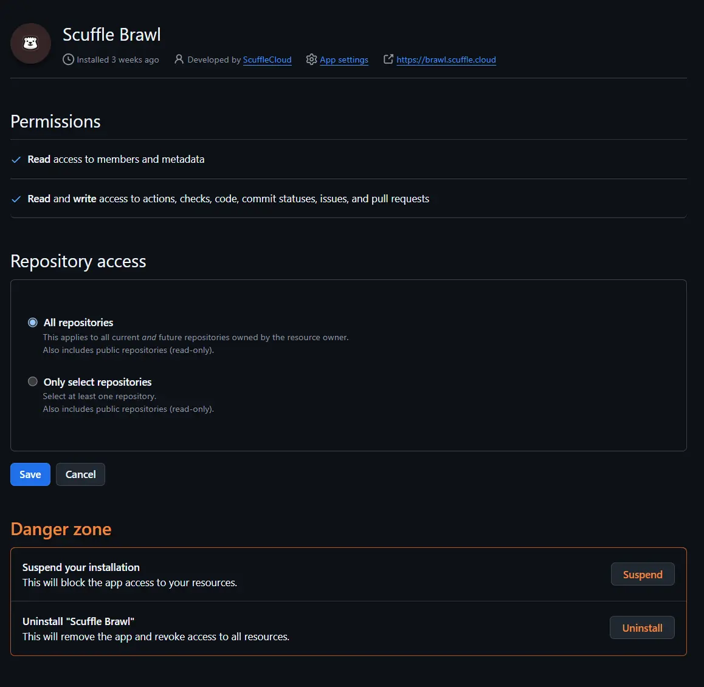

# Setup

## 1. Create a new GitHub App.

The first step is to create a new GitHub App, you can do this by going to your profile or organization settings, and clicking on the `Developer settings` tab, followed by `GitHub Apps`. 


Then clicking `New GitHub App`.


Then filling out the form for a name and short description.


## 2. Provide a webhook URL

While filling out the form, you can optionally provide a webhook URL.

Brawl uses webhooks to do live updates and respond to commands issued by users, so for the app to work you will need to provide a webhook URL.


## 3. Permissions

The next step is to configure the permissions that the app will have, brawl needs a bunch of permissions to work.


Under the `Repository permissions` section, you need to enable the following permissions:

- **`Read and write`** access to **`Actions`**
- **`Read Only`** access to **`Administration`**
- **`Read and write`** access to **`Checks`**
- **`Read and write`** access to **`Commit Statuses`**
- **`Read and write`** access to **`Contents`**
- **`Read and write`** access to **`Issues`**
- **`Read and write`** access to **`Pull Requests`**

And then under the `Organization permissions` section, you need to enable the following permissions:

- **`Read only`** access to **`Members`**

Brawl does not need any of the permissions under the **`Account permissions`** section.

## 4. Webhook Events

After configuring permissions GitHub will show you a list of events that the app can subscribe to. Brawl will ignore any event that it does not need, so you can safely subscribe to all of them if you want. However the minimum set of events brawl needs to work are:

- **`Installation Target`**
- **`Meta`**
- **`Check Run`**
- **`Check Suite`**
- **`Commit Comment`**
- **`Create`**
- **`Delete`**
- **`Issue Comment`**
- **`Issues`**
- **`Label`**
- **`Member`**
- **`Pull Request`**
- **`Pull Request Review`**
- **`Pull Request Review Comment`**
- **`Pull Request Review Thread`**
- **`Pull Request Thread`**
- **`Push`**
- **`Repository`**
- **`Status`**
- **`Workflow Dispatch`**
- **`Workflow Job`**
- **`Workflow Run`**

## 5. Generate a private key

Once you have completed the previous steps and have created a GitHub App, you can then generate a private key to make authenticated requests to the GitHub API.

In the `General` tab of the GitHub App settings page you can scroll down to the `Private keys` section and click `Generate a private key`.

You will be prompted to download a `.pem` file and you can save this to your machine for later use.


## 6. Configure the brawl server

Brawl uses a `config.toml` file to configure the app, and you can find the full configuration reference [here](./configuration.md).

An example configuration file would look like this:

```toml
[github]
app_id = "..."
private_key_pem = "..."
webhook_secret = "..."
```

## 7. Start the server

If you are running the server on a development environment.

```shell
cargo run --bin scuffle-brawl -- -c config.toml
```

Alternatively, you can run a pre-compiled binary.

```shell
./scuffle-brawl -c config.toml
```

## 8. Setup a reverse proxy.

In order to receive webhooks, you need to setup a reverse proxy.

We recommend using [cloudflared](https://github.com/cloudflare/cloudflared) for this.

You can find the full setup instructions [here](https://developers.cloudflare.com/cloudflare-one/connections/connect-networks/get-started/).

## 9. Install the app on your account or organization

Once everything is setup you can install the app onto your account or organization, and then configure which repositories the app can work in.



## 10. Configure a repo to use brawl.

By default, regardless of which repositories the app is installed in, brawl will not run on any repos unless they have a `.github/brawl.toml` file present.

Just having the file present is enough to enable brawl for that repo, however you can configure the behaviour of the bot refer to the [repository configuration reference](./repository-configuration.md) for more extensive configuration options. You can also look at this repository's [`.github/brawl.toml`](../.github/brawl.toml) file for an example. 

This file is used to configure brawl for a given repo.

## 11. Success!

You can now use brawl in your CI/CD pipeline, to see what commands are available go to the [commands reference](./commands.md).
